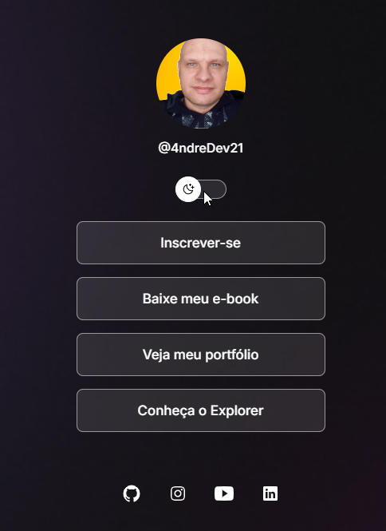

# 🌐 Personal Website - Dark/Light Mode Toggle


## Sobre o Projeto

Este é um projeto de site pessoal desenvolvido com **HTML**, **CSS** e **JavaScript**. O principal objetivo é alternar entre os modos claro e escuro, proporcionando uma melhor experiência de navegação. O site inclui uma foto de perfil, links principais, links para redes sociais, e foi estilizado com um design moderno e responsivo.

## 🎨 Funcionalidades

- **Modo Escuro/Claro:** Alternância suave entre temas para diferentes ambientes de visualização.
- **Foto de Perfil Dinâmica:** Imagem e texto descritivo alteram conforme o tema.
- **Links Principais:** Navegação para inscrições, e-book, portfólio e Explorer.
- **Links Sociais:** Acesso rápido às redes sociais com ícones animados.

## 🚀 Tecnologias Utilizadas

- **HTML5:** Estrutura semântica e acessível.
- **CSS3:** Design responsivo, animações e transições.
- **JavaScript:** Lógica de alternância entre modos e manipulação do DOM.
- **Google Fonts:** Tipografia customizada com a fonte _Inter_.
- **Ionicons:** Ícones para as redes sociais.

## 🖼️ Demonstração




## 🛠️ Como Utilizar

1. Clone o repositório:
   ```bash
   git clone https://github.com/4ndreDev21/social-links.git
